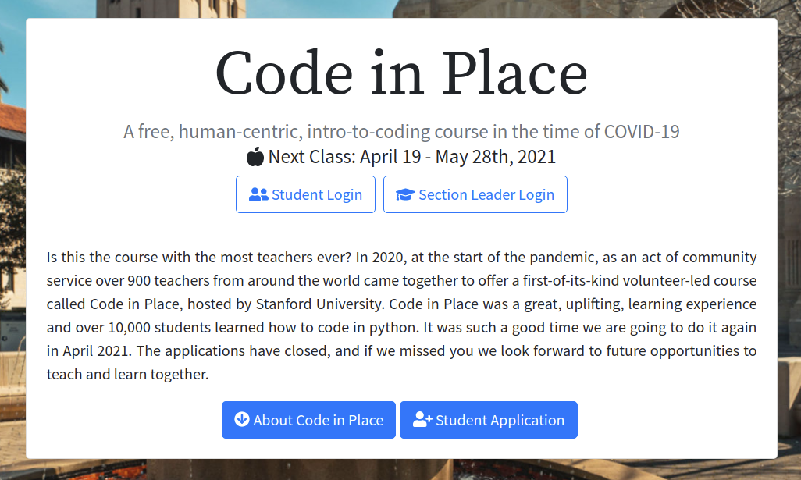

# Code In Place Spring 2021
Code in Place is a free programming course using the Python language, it covers the introductory part of python using Karel to teach the fundamentals of programming.

More information here: https://codeinplace.stanford.edu/course

<p align="center">
  
</p>

## Karel commands

### Base Karel commands
```python
move()
turn_left()
put_beeper()
pick_beeper()
```
### Names of the conditions
```python
front_is_clear()
beepers_present()
beepers_in_bag()
left_is_clear()
right_is_clear()
facing_north()
facing_south()
facing_east()
facing_west()
front_is_blocket()
no_beepers_in_bag()
left_is_bocked()
right_is_blocked()
not_facing_north()
not_facing_south()
not_facing_east()
not_facing_west()
```
### Karel program structures
```python
def main()
  code to execute

declarations of other functions
```
### Conditions
```python
if condition:
  code run in condition passes
if condition:
  code block for "yes"
else:
  code block for "no"
```

### Lops
```python
for i in range(count):
  code to repeat
while condition:
  code to repeat
```

### Function Declaration
```python
def name():
  code in the vody of the fucntion.
```

### Extra Karel Commands:
```python
paint_corner(COLOR_NAME)
corner_color_is(COLOR_NAME)
```
### Painting corners
```python
BLANK, will removes any color on the squeare
BLACK
BLUE
CYAN
DARK_GRAY
GRAY
GREEN
LIGHT_GRAY
MAGENTA
ORANGE
PINK
RED
WHITE
YELLOW
```
